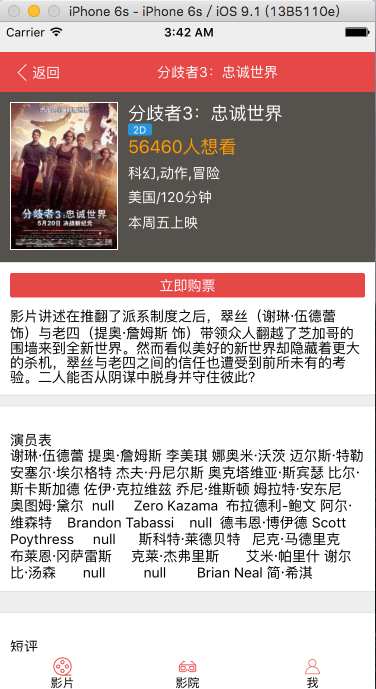
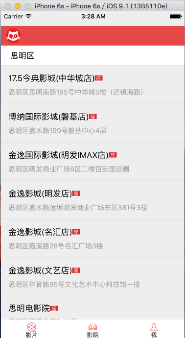

# change log

**运行之前请先对项目中的数据接口(xxx)进行替换.**

---
# maoyanFilm
这是一个仿猫眼电影的App，基于React Native构建。
由于找到的猫眼API并不完整，所以只能实现部分页面。
代码写得都很简单，欢迎一起交流学习。(大牛请忽略)

## 运行
### Android
1. 进入maoyanFilm根目录，安装依赖:`npm install`
2. 连接手机机或者虚拟机
3. 运行`react-native start` `react-native run-android`

### IOS
1. 进入maoyanFilm根目录，安装依赖:`npm install`
2. XCode打开ios下的film.xcodeproj
3. 点击Run

## Android安装包

## 用到的React Native技术
* Flex 布局
* Image/Text/ListView/TouchableOpacity/ToolbarAndroid/Navigator/ScrollView/ProgressBarAndroid等组件
* ScrollView纵向、横向列表
* Tabbar导航
* Tab选项卡局部切换
* ScrollView上拉加载
* ...

## Android演示：

(录制于原生安卓模拟器,真机效果会更流畅)

## IOS截图：

## TODO
- [X] 更多评论列表
- [X] 影院列表页
- [X] 影院详情页
- [ ] ~~选座页网上的API返回数据有问题~~
- [X] 登录页

## License

This project is available under the MIT license.
